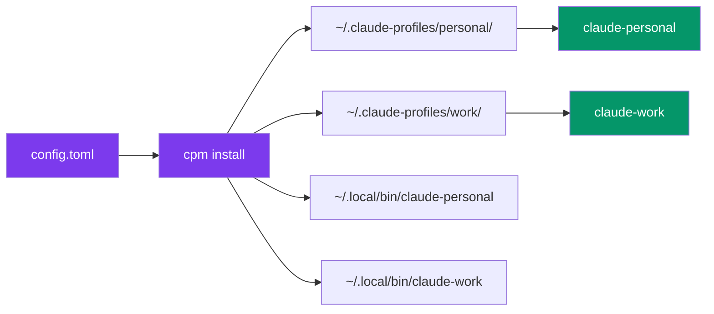
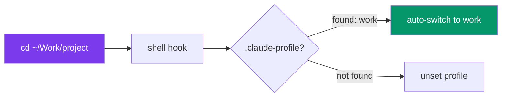

<p align="center">
  
</p>

<h1 align="center">cpm</h1>

<p align="center">
  <strong>Claude Profile Manager</strong> — run multiple Claude Code accounts side-by-side<br/>
  with isolated credentials, shared config, and zero overhead.
</p>

<p align="center">
  <a href="https://github.com/jakubkontra/claude-profile-manager/actions/workflows/test.yml"></a>
  <a href="https://github.com/jakubkontra/claude-profile-manager/releases/latest"></a>
  <a href="https://github.com/jakubkontra/claude-profile-manager/blob/main/LICENSE"></a>
</p>

<p align="center">
  
</p>

---

## Why?

You have a personal Claude subscription and a company one. Or a Vertex AI setup. Or three clients. Every time you switch, you re-login, lose context, or mix credentials.

**cpm** gives each account its own `claude-<name>` command. Run them in parallel, auto-switch per project, never re-login.

```
claude-personal     # Personal Anthropic subscription
claude-work         # Company team account
claude-vertex       # Company via Google Cloud Vertex AI
```

## How it works



Each profile gets an isolated `CLAUDE_CONFIG_DIR` with its own credentials, while sharing commands, skills, plugins, and projects via symlinks:

```
~/.claude-profiles/
├── config.toml
├── personal/
│   ├── settings.json        # Copied (mutable)
│   ├── CLAUDE.md            # Copied (mutable)
│   ├── commands/ -> ~/.claude/commands/   # Symlinked
│   ├── skills/   -> ~/.claude/skills/     # Symlinked
│   ├── plugins/  -> ~/.claude/plugins/    # Symlinked
│   ├── projects/ -> ~/.claude/projects/   # Symlinked
│   ├── .credentials.json    # Per-profile (created by Claude)
│   └── .claude.json         # Per-profile (created by Claude)
└── work/
    └── ...
```

## Install

### Homebrew (macOS/Linux)

```bash
brew install jakubkontra/tap/cpm
```

### GitHub Releases

Download the latest binary from [Releases](https://github.com/jakubkontra/claude-profile-manager/releases/latest):

```bash
# macOS (Apple Silicon)
curl -L https://github.com/jakubkontra/claude-profile-manager/releases/latest/download/cpm_darwin_arm64 -o ~/.local/bin/cpm
chmod +x ~/.local/bin/cpm
```

### From source

```bash
go install github.com/jakubkontra/cpm@latest
```

### Windows (PowerShell 7+)

```powershell
scoop bucket add cpm https://github.com/silicondawn/cpm
scoop install cpm

# Or download cpm_windows_amd64.zip from Releases, extract, and drop
# cpm.exe somewhere on PATH (e.g. $env:LOCALAPPDATA\cpm\bin):
#   https://github.com/silicondawn/cpm/releases/latest

cpm init             # interactive setup
cpm install          # creates claude-<name>.cmd + claude-<name>.ps1 wrappers
claude-personal      # works just like on macOS/Linux

# Auto-switch hook — add to $PROFILE:
Invoke-Expression (& cpm hook | Out-String)
```

Notes:
- Requires **PowerShell 7+** (`pwsh`). Windows PowerShell 5.1 is not supported. Install via `winget install Microsoft.PowerShell`.
- Profile-shared directories use junctions (no admin needed). For the rare cross-volume case, enable **Developer Mode** in Windows Settings.
- `cpm.exe` self-upgrade uses a rename-old / rename-new trick — no admin needed.

## Quick start

```bash
# 1. Create config interactively
cpm init

# 2. Or manually create ~/.claude-profiles/config.toml
cat > ~/.claude-profiles/config.toml << 'EOF'
source_dir = "~/.claude"
bin_dir = "~/.local/bin"

[profiles.personal]
description = "Personal account"

[profiles.work]
description = "Company account"
model = "sonnet"
add_dirs = ["~/Work/company"]
EOF

# 3. Install profiles + wrapper scripts
cpm install

# 4. Authenticate each profile (first time only)
claude-personal    # Opens browser for OAuth
claude-work        # Opens browser for OAuth
```

## Per-project profiles (like .nvmrc)



Link a profile to any project directory:

```bash
# Set profile for this project
cd ~/Work/company-project
cpm link work

# Auto-switch on cd (add to .zshrc once)
eval "$(cpm hook)"

# Now every time you cd into this project:
cd ~/Work/company-project
# [cpm] using profile: work

cd ~/personal-project
# [cpm] using profile: personal
```

The `.claude-profile` file is automatically added to `.gitignore`.

## Commands

| Command | Description |
|---------|-------------|
| `cpm install` | Create profile directories and wrapper scripts |
| `cpm install --sync` | Re-sync mutable files from `~/.claude` |
| `cpm install --sync --force` | Force overwrite diverged files |
| `cpm list` | List all profiles with status |
| `cpm which` | Show active profile (from env or `.claude-profile`) |
| `cpm status` | Check sync divergence |
| `cpm doctor` | Diagnose issues (broken symlinks, expired creds, ...) |
| `cpm credentials` | Show OAuth token status for all profiles |
| `cpm use <profile>` | Switch shell: `eval "$(cpm use work)"` |
| `cpm run <profile> [args]` | One-shot: `cpm run work -p "explain this"` |
| `cpm link <profile>` | Create `.claude-profile` in current dir |
| `cpm unlink` | Remove `.claude-profile` |
| `cpm hook` | Print shell hook for auto-switch |
| `cpm direnv <profile>` | Print `.envrc` snippet |
| `cpm clone <src> <dst>` | Clone profile (without credentials) |
| `cpm init` | Interactive config wizard |
| `cpm version` | Show version + check for updates |
| `cpm upgrade` | Self-update from GitHub Releases |
| `cpm cloud init [--remote <url>]` | Initialize cloud sync repo |
| `cpm cloud push [-m "msg"]` | Push local settings to cloud |
| `cpm cloud pull [--dry-run]` | Pull settings from cloud |
| `cpm cloud status` | Show cloud sync status |
| `cpm cloud remote <url>` | Set/update git remote URL |

## Cloud sync

Sync your Claude Code settings (plugins, skills, commands, `settings.json`) across machines via a private git repository.

```bash
# On your first machine — initialize and push
cpm cloud init --remote git@github.com:you/claude-settings.git
cpm cloud push

# On another machine — clone and pull
cpm cloud init --remote git@github.com:you/claude-settings.git
# Files are automatically distributed on clone

# Later — sync changes
cpm cloud push   # from the machine where you changed settings
cpm cloud pull   # on the other machine
```

### What gets synced

| Synced | Not synced |
|--------|------------|
| `settings.json`, `settings.local.json` | Credentials (`.credentials.json`) |
| `CLAUDE.md` | Sessions, caches |
| `commands/`, `agents/` | `projects/` (cache, ~2 GB) |
| `plugins/installed_plugins.json` | Telemetry |
| `plugins/known_marketplaces.json` | |
| `.skill-lock.json` | |
| CPM `config.toml` | |

### Exclude files from sync

```toml
[cloud]
remote = "git@github.com:you/claude-settings.git"
exclude = ["CLAUDE.md", "commands/"]
```

## Configuration

### `~/.claude-profiles/config.toml`

```toml
source_dir = "~/.claude"
bin_dir = "~/.local/bin"

[profiles.personal]
description = "Personal Anthropic account"

[profiles.work]
description = "Company team subscription"
model = "sonnet"
add_dirs = ["~/Work/company"]

[profiles.work.attribution]
commit = "Co-Authored-By: Claude <noreply@anthropic.com>"
pr = "Generated with [Claude Code](https://claude.ai/code)"

[profiles.vertex]
description = "Company via Vertex AI"
add_dirs = ["~/Work/company"]

[profiles.vertex.env]
CLAUDE_CODE_USE_VERTEX = "1"
ANTHROPIC_VERTEX_PROJECT_ID = "your-project-id"
CLOUD_ML_REGION = "europe-west1"
```

### Config reference

| Field | Default | Description |
|-------|---------|-------------|
| `source_dir` | `~/.claude` | Source for shared config |
| `bin_dir` | `~/.local/bin` | Where wrapper scripts are installed |
| `profiles.<name>.description` | | Human-readable description |
| `profiles.<name>.model` | | Default model (`sonnet`, `opus`) |
| `profiles.<name>.add_dirs` | | Extra dirs passed via `--add-dir` |
| `profiles.<name>.env` | | Environment variables |
| `profiles.<name>.attribution.commit` | | Git commit attribution text |
| `profiles.<name>.attribution.pr` | | PR description attribution text |
| `cloud.remote` | | Git remote URL for cloud sync |
| `cloud.auto_push` | `false` | Auto-push on `cpm install` |
| `cloud.exclude` | `[]` | Files/dirs to exclude from sync |

### Shared file handling

| Type | Files | Behavior |
|------|-------|----------|
| **Copied** | `settings.json`, `settings.local.json`, `CLAUDE.md` | Copied on first install. `--sync` to refresh. |
| **Symlinked** | `commands/`, `skills/`, `agents/`, `plugins/`, `projects/` | Shared across all profiles |
| **Per-profile** | `.credentials.json`, `.claude.json`, `teams/` | Created by Claude on first use |

## Shell integration

### Prompt (PS1 / Starship)

Show active profile in your terminal prompt:

```bash
# .zshrc — simple
PROMPT='$(cpm prompt)> '

# Starship — custom command
[custom.claude]
command = "cpm prompt"
when = "test -n \"$CLAUDE_PROFILE\""
format = "[$output]($style) "
style = "purple"
```

### direnv

```bash
# Generate .envrc for a project
cpm direnv work >> ~/Work/company-project/.envrc
direnv allow ~/Work/company-project
```

## Upgrading

```bash
# Self-update
cpm upgrade

# Or via Homebrew
brew upgrade cpm
```

## Requirements

- macOS, Linux, or Windows 10/11 (PowerShell 7+ for the Windows version — Windows PowerShell 5.1 not supported)
- Claude Code installed and on PATH
- `~/.local/bin` (Unix) or `%LOCALAPPDATA%\cpm\bin` (Windows) on PATH (or configure `bin_dir`)

## License

[MIT](LICENSE)
